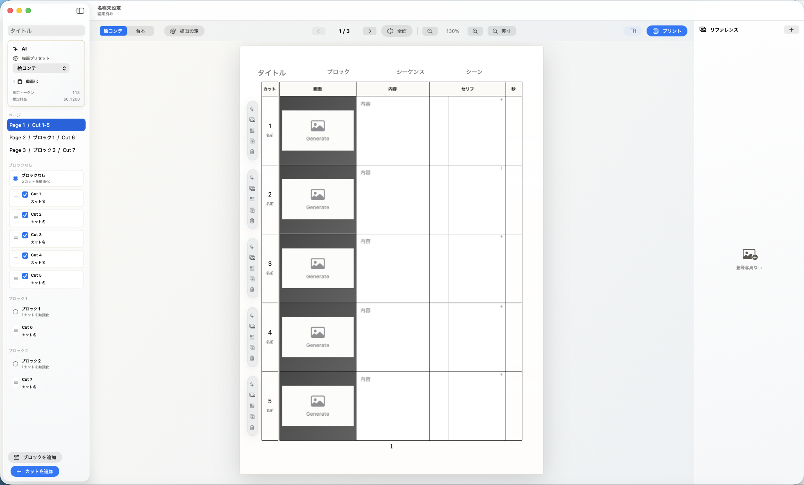

# Cinema



Cinemaは、映像制作向けの絵コンテと台本を1つのドキュメントで作成できるmacOSアプリです。カットごとの画面、内容、セリフ、秒数を紙面に近いレイアウトで編集しながら、AI画像生成やシーン単位の動画生成、リファレンス画像管理までを同じ作業画面で扱えます。

## 概要

Cinemaは、企画段階のアイデアを絵コンテとして素早く形にし、必要に応じて画像や動画へ発展させるための制作ツールです。白を基調にした編集画面で、ページ単位の絵コンテ、台本表示、リファレンス、描画プリセットを行き来できます。

## 主な機能

- 絵コンテページの編集
  - カット番号、カット名、画面、内容、セリフ、秒数をページ上で直接編集できます。
- ブロック管理
  - カットをブロック単位で整理し、ページやシーンへ素早く移動できます。
- 台本表示
  - 入力した内容とセリフを台本形式でも確認できます。
- AI画像生成
  - GeminiまたはOpenAIを使って、カットの画面イメージを生成できます。
- シーン動画生成
  - 選択したブロックのカットをもとに、シーン単位の動画生成を行えます。
- リファレンス管理
  - 右サイドバーで参考画像を登録し、各カットの生成プロンプトに活用できます。
- 印刷
  - 現在の絵コンテページや台本ページをプリントできます。

## 動作環境

- macOS 14以降
- Swift 5.10以降

## 起動方法

```sh
swift run Cinema
```

または、付属スクリプトを使ってビルドと起動を行えます。

```sh
./script/build_and_run.sh
```

## 設定

アプリの設定画面から、Gemini / OpenAIのAPIキー、画像生成モデル、動画生成モデル、表示設定、AI利用料金の上限などを設定できます。
