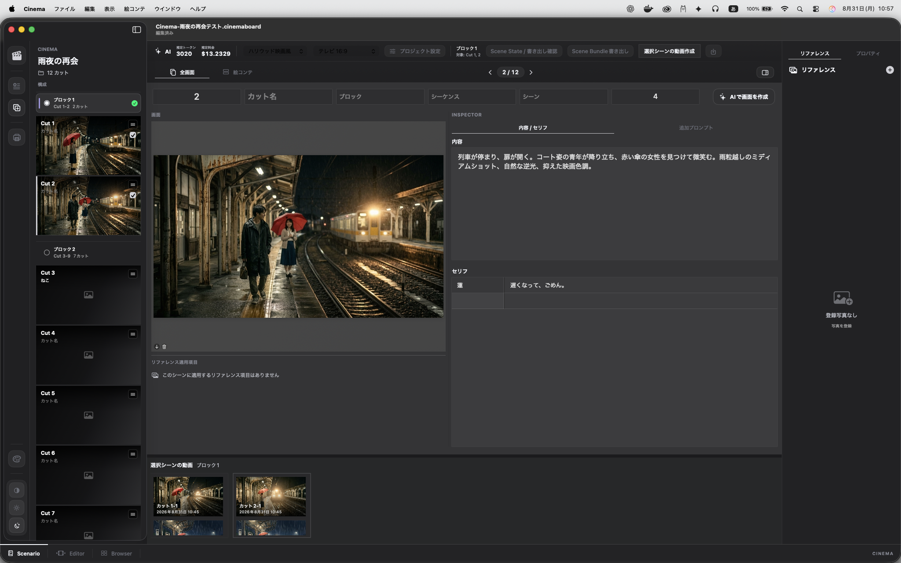
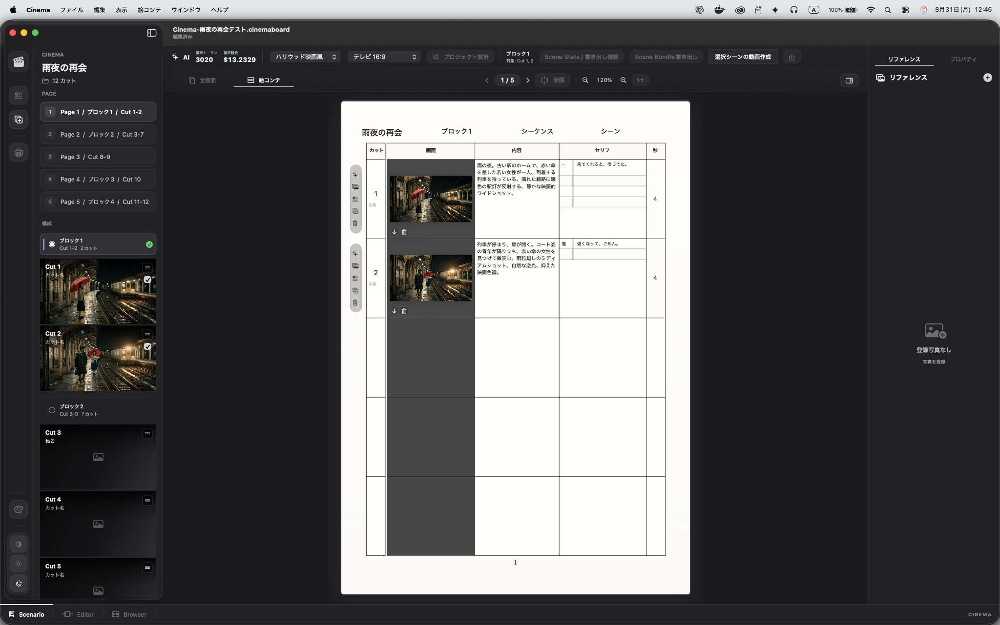

# Cinema






Cinema is a native macOS pre-production workspace for designing cinematic scenes, storyboards, dialogue, and AI-assisted visual previews in one document.

It is built for filmmakers, directors, storyboard artists, and small production teams who want to move from an idea to a structured sequence of cuts without scattering project context across prompt files, spreadsheets, image folders, and generation tools.

> Cinema itself is free to use. AI generation requires your own API key, and the selected provider may charge for requests.

[Download the latest release](https://github.com/matsushibadenki/Cinema/releases/latest)

## What Cinema Does

Cinema treats a production as more than a list of isolated prompts. Each project can carry a project-wide production direction, persistent scene state, references, cut-level instructions, dialogue, timing, generated images, and video versions.

The Scenario workspace brings these elements together:

- Organize a project into blocks and cuts.
- Edit cut numbers, names, scene descriptions, dialogue, duration, and shot direction.
- Work in a focused cut view or a printable storyboard view.
- Generate storyboard images and scene videos with supported AI providers.
- Preserve visual continuity between cuts while allowing explicit scene resets.
- Maintain reusable reference images and scene-level production state.
- Export a portable Scene Bundle for a separate Colab notebook, GPU worker, or open-weight inference project.

## Key Features

### Storyboard and Cut Authoring

- Direct editing of image, content, dialogue, duration, block, sequence, and scene metadata.
- Block and cut operations through contextual menus.
- Drag-and-drop cut reordering.
- Focused cut editing and multi-cut storyboard layouts.
- Adjustable storyboard text size and column width.
- Printable storyboard pages.

### Project Design

The Project Design field works like a project-level system prompt. It defines guidance that should remain consistent across the entire production, such as:

- Genre and narrative intent
- World and historical period
- Mood and emotional tone
- Recurring characters and appearance
- Performance direction
- Production design and visual language
- Global restrictions and content to avoid

Cinema stores this direction in the project document and places it ahead of cut-specific instructions when building image prompts, video prompts, and Scene Bundles.

### Continuity-Oriented Prompting

Cinema builds prompts with explicit continuity rules rather than treating every cut as unrelated.

- Same-scene cuts can inherit identity, wardrobe, props, location geometry, lighting, color temperature, weather, and screen direction from the previous cut.
- Shot Delta fields describe only what is allowed to change.
- Scene-transition markers reset inherited visual context when a location, time, or scene changes.
- Drawing presets can influence craft and rendering style without silently replacing established scene state.

These controls improve consistency, but they cannot guarantee deterministic output from third-party generative models.

### Persistent Scene State

Scene State records durable production truth across eight categories:

- Character
- Object
- Environment
- Camera
- Lighting
- Event
- Timeline
- Audio

The Scene State editor also supports persistent rules, event transitions, world-state prompts, reference associations, and export validation. This allows each cut to describe local changes without repeating the entire world definition.

### Reference Management

- Register visual references in the right sidebar.
- Associate references with cuts and scenes.
- Add structured notes describing how each reference should be applied.
- Include referenced assets and metadata in exported Scene Bundles.

### AI Image and Video Generation

Cinema supports provider and model selection from Preferences. Recommended models are available as presets, and custom model identifiers can be entered when needed.

| Provider      | Image | Video | Notes                                        |
| ------------- | :---: | :---: | -------------------------------------------- |
| Google Gemini |  Yes  |  Yes  | Video generation uses supported Veo models.  |
| OpenAI        |  Yes  |  Yes  | Video generation uses supported Sora models. |
| DeepInfra     |  Yes  |  Yes  | Model catalogs can be refreshed in the app.  |
| Novita        |  Yes  |  Yes  | Uses asynchronous image and video APIs.      |
| Hyperbolic    |  Yes  |  No   | Video generation is not connected.           |

Provider availability, model identifiers, supported parameters, pricing, and regional access can change independently of Cinema.

### Generated Video History

- Keep multiple generated versions for each cut.
- Preview versions using the active project aspect ratio.
- Identify versions as `Cut 2-1`, `Cut 2-2`, and so on.
- Open or save generated media from the Scenario workspace.

### Aspect Ratios

Cinema includes the following screen presets:

- Television `16:9`
- Short video `9:16`
- Cinema `1.85:1`
- CinemaScope `2.39:1`
- Academy `4:3`
- Custom width and height

The selected ratio is used by the cut preview, generated-media presentation, storyboard printing, and export metadata.

### Scene Bundle Export

Cinema is designed as an export-first authoring tool. It does not need to embed every open-weight model runtime directly into the macOS app.

A Scene Bundle contains a versioned manifest, prompts, storyboard frames, reference images, scene state, provider metadata, aspect ratio, duration, seeds, continuity instructions, and validation warnings.

```text
<scene>_cinema_bundle_v1/
├── manifest.json
├── README.txt
├── prompts/
│   ├── scene.txt
│   ├── world-state.txt
│   ├── cut-001-image.txt
│   └── cut-001-video.txt
├── storyboard/
│   └── cut-001.png
└── references/
    └── <reference-uuid>.png
```

This keeps Cinema focused on production design while allowing a separate Google Colab or GPU project to evolve its model installation, dependencies, and inference code independently.

See [Cinema Scene Bundle v1](doc/CINEMA_SCENE_BUNDLE_V1.md) for the compatibility contract.

## Requirements

### Prebuilt Release

- macOS 14 or later
- Apple Silicon Mac
- An API key for any AI provider you choose to use

The distributed application is signed with Developer ID, notarized by Apple, and supports automatic updates through Sparkle.

### Building from Source

- macOS 14 or later
- Swift 5.10 or later
- Xcode or the Swift toolchain

Clone the repository and run:

```sh
swift run Cinema
```

Or use the included app-bundle script:

```sh
./script/build_and_run.sh
```

Run the test suite with:

```sh
swift test
```

## Getting Started

1. Download and open the latest release, or build Cinema from source.
2. Open Preferences and choose an image-generation provider and a video-generation provider.
3. Enter the required API keys and select models.
4. Choose the project language and screen aspect ratio.
5. Enter a Project Design direction for the complete production.
6. Create blocks and cuts, then add scene content, dialogue, duration, and shot instructions.
7. Register references and define Scene State where continuity matters.
8. Generate storyboard images or selected-scene videos.
9. Print the storyboard or export a Scene Bundle for an external runner.

## Documents and Local Data

Cinema projects use the `.cinemaboard` document type. Project content, generated-media references, Scene State, and production metadata are stored with the document.

API keys are configured locally in application preferences. Scene Bundle export intentionally excludes API keys, authentication tokens, and absolute paths from the manifest.

Keep backups of important project documents and generated media. Third-party API output may not be reproducible if a provider changes or retires a model.

## Cost Controls

Cinema displays estimated token use and estimated cost, and includes an optional USD cost limit. These values are planning aids only. The provider's billing dashboard is the authoritative source for actual usage and charges.

## Languages

The application interface supports:

- English
- Japanese
- Simplified Chinese

## Automatic Updates

Cinema checks a signed Sparkle appcast hosted in this repository. You can also manually select **Cinema > Check for Software Updates** from the application menu.

Release downloads are available on the [GitHub Releases page](https://github.com/matsushibadenki/Cinema/releases).

## Current Scope

- The Scenario workspace is implemented.
- Editor and Browser tabs are reserved for future workflows.
- Hyperbolic video generation is not connected.
- Local open-weight video generation is not bundled into Cinema.
- External runner result import and round-trip attachment are not implemented yet.

## Roadmap

- [Done] Project-wide production direction, continuity contracts, persistent Scene State, Scene Bundle export, and export validation.
- [Next] Define a result bundle and round-trip import path from external inference runners.
- [Later] Research separate film/color processing and experimental Apple Silicon local-generation backends without coupling them to the SwiftUI interface.

See the full [Cinema Roadmap](doc/ROADMAP.md).

## Repository Structure

```text
Sources/Cinema/
├── App/          Application entry point and commands
├── Models/       Project, cut, provider, aspect-ratio, and scene-state models
├── Services/     AI providers, prompt building, export, printing, and updates
├── Support/      Localization and shared support code
└── Views/        SwiftUI workspaces, editors, sidebars, and storyboard views

Tests/CinemaTests/  Unit and migration tests
doc/                Public specifications, roadmap, and images
script/             Local build, release, notarization, and appcast tools
```

## License

No open-source license has been published for this repository yet. Source availability does not grant permission to redistribute or create derivative works.
